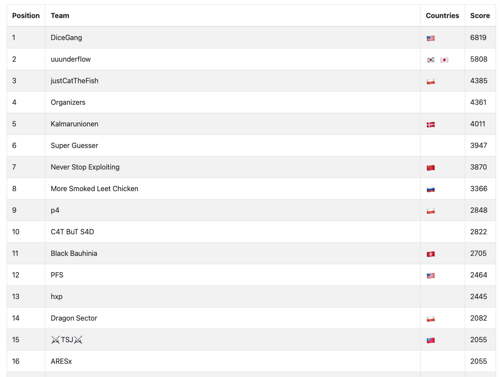
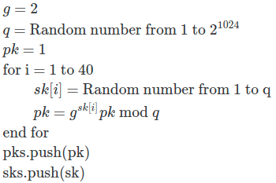
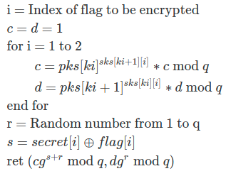

# PWN2WIN CTF

CTF organized by <https://pwn2win.party> on May 28th for 48 hours. We ranked 16th with a rough tie for 15th place!



<!-- Linking challenges -->

[Ruthless Monster](./ruthlessMonster.md ':include')

---

[Illusion](./illusion.md ':include')

---

[Oh Anna Julia](./julia.md ':include')

## Server code

```julia=
#!/usr/sbin/julia
import Primes: nextprime

struct Data
  g::BigInt
  q::BigInt
  sks::Array{Array{BigInt}}
  pks::Array{BigInt}
  secret::Array{UInt8}
end

function create_key(len::Int, data::Data)
  sk::Array{BigInt} = []
  pk::BigInt = 1

  if length(data.pks) ≥ 10
    println("Enough of key creation!")
    return
  end

  for i in 1:len
    push!(sk, rand(1:data.q))
    pk = powermod(data.g, sk[i], data.q) * pk % data.q
  end
  push!(data.sks, sk)
  push!(data.pks, pk)
  println("Key created sucessfully!")
end

function create_secret(len::Int, data::Data)
  println("Tell me your secret: ")
  readbytes!(stdin, data.secret, len)
end

function show_data(data::Data)
  println("g = ", data.g)
  println("q = ", data.q)
  println("secret = ", data.secret)
  println("pks = ", data.pks)
end

function encrypt(flag::String, data::Data)
  i::Int = 0
  c::BigInt = 1
  d::BigInt = 1
  r::BigInt = 1
  s::Int = 0

  if length(data.pks) < 4
    println("Error: You don't have enough keys to encrypt.")
    return
  end

  if length(data.secret) ≠ length(flag)
    println("Error: Invalid secret. Make sure you create a secret first!")
    return
  end

  println("Which char index you want to encrypt?")
  try i = parse(Int, readline()) catch e i = -1 end
  if !(1 ≤ i ≤ length(flag))
    println("Error: Invalid char index!")
    return
  end

  for ki in 1:2:(length(data.pks)-1)
    c = powermod(data.pks[ki], data.sks[ki + 1][i], data.q) * c % data.q
    d = powermod(data.pks[ki + 1], data.sks[ki][i], data.q) * d % data.q
  end

  r = rand(1:data.q)
  s = data.secret[i] ⊻ Int(flag[i])
  c = powermod(data.g, s + r, data.q) * c % data.q
  d = powermod(data.g, r, data.q) * d % data.q

  println("Here we go: ", (c, d))
end

function menu()::Int
  println()
  println("1- Create Key")
  println("2- Create Secret")
  println("3- Show data")
  println("4- Encrypt Flag")
  println("5- Exit")
  println()
  option::Int = 0
  try option = parse(Int, readline()) catch e return -1 end
  return option
end

function main()
  flag::String = strip(open(f->read(f, String), "flag.txt"))
  data::Data = Data(2, nextprime(rand(0: big(2)^1024)), [], [], [])
  @assert length(flag) == 40

  println("\nWelcome! What's your plan for today?")
  while true
    option::Int = menu()
    if option == 1
      create_key(length(flag), data)
    elseif option == 2
      create_secret(length(flag), data)
    elseif option == 3
      show_data(data)
    elseif option == 4
      encrypt(flag, data)
    elseif option == 5
      println("Bye!")
      return
    else
      println("Invalid option!")
    end
  end
end

main()

```

## Summary

We needed to create keys at least four times and input the secret at least once. Then, we could interact with an oracle that provided the encrypted value of the flag at a given index.

#### Option 1 - Create Key



#### Option 4 - Encrypt Flag



## Attack

Referencing the psuedocode in option 4, we can brute force each byte of the flag by setting the corresponding secret byte as our guess. If we guessed the correct byte of the flag, the $s$ value will be $0$.

We get the pair $(c', d')$ back from the server in option 4. Because $c'd'^{-1} \bmod q = g^s cd^{-1} \bmod q$, forcing $s=0$ means we can extract $cd^{-1}$. This is really really important because whenever we call encrypt with the same index, $c$ and $d$ stay the same.

How do we know if we have the correct value of the flag? Again, we assume our guessed secret byte is the flag byte. Then, we assume that our calculated $c'd'^{-1} = cd^{-1}$. Next, we change the secret byte by an offset (1-255) and calculate the new value of $c'd'^{-1}$, which should be $cd^{-1}g^{s\in [1,255]}\bmod{q}$. If the oracle spits out the expected values, then we have discovered the flag byte. We have to brute force at most 256 * 255 encryptions for each byte of the flag.

Another interesting but useless property of this cryptosystem we found was $\sum_{i=1}^{40} c_i'd_i'^{-1} = \sum \text{flag}$, where $c_{index}', d_{index}' = \text{encrypt(index)}$.

## Solution script

```python=
from Crypto.Util.number import getPrime
from random import randint
import gmpy2
from pwn import *

# context.log_level = 'debug'

r = remote('oh-anna-julia.pwn2win.party', '1337')
# r = process(['julia', 'chall.jl'])
g = 2
secret = [0] * 40


def create_key():
    r.sendline('1')


def encrypt(index):
    r.sendline('4')
    r.sendline(str(index+1))
    r.recvuntil("Here we go: ")
    c, d = eval(r.recvline().strip().decode())
    return c, d


def create_secret():
    r.sendline('2')
    r.sendline(''.join(chr(s) for s in secret))


for i in range(4):
    create_key()


r.sendline('3')
r.recvuntil('q = ')
q = int(r.recvline().strip().decode())
r.recvuntil('pks = BigInt')
pks = r.recvline()
exec("pks = " + pks.decode())


good_flag = ''
for ind in range(40):
    print("ind", ind)
    secret = [0] * 40
    create_secret()
    for guess in range(256):
        secret = secret[:ind] + [guess] + secret[ind + 1:]
        create_secret()
        _c, _d = encrypt(ind)
        _e = (_c * gmpy2.invert(_d, q)) % q
        
        bad = False
        for addd in range(1, 256):
            secret = secret[:ind] + [(guess + addd) % 256] + secret[ind + 1:]
            create_secret()
            _c2, _d2 = encrypt(ind)
            _e2 = (_c2 * gmpy2.invert(_d2, q)) % q
            
            if _e2 != ((_e * pow(g, ((guess + addd) % 256) ^ (guess))) % q):
                bad = True
                break

        if not bad:
            print("value at index:", ind, "is:", guess)
            good_flag += chr(guess)
            break

print("flag:", good_flag)
```

The flag was `CTF-BR{Qu3m_te_v3_pass4r_4ssim_p0r_Mim.}`.

---

[Baby Write Only](./babyWriteOnly.md ':include')

---

[Cmon See My Vulns](./vulns.md ':include')

---

[Lost Exponent](./lostExponent.md ':include')

---

[Dots Exposed](./dotsExposed.md ':include')

---

[Small Talk](./smallTalk.md ':include')